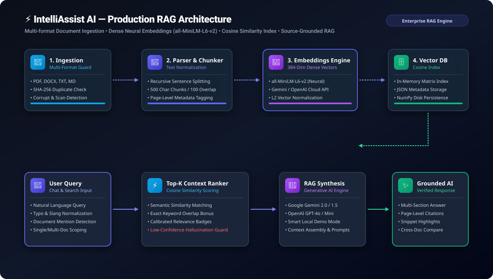

# ⚡ IntelliAssist AI — Smart Document AI Assistant

<div align="center">

[](https://python.org)
[](https://streamlit.io)
[-06b6d4?style=for-the-badge)](https://huggingface.co/sentence-transformers/all-MiniLM-L6-v2)
[](https://huggingface.co/cross-encoder/ms-marco-MiniLM-L-6-v2)
[-success?style=for-the-badge&logo=pytest&logoColor=white)](https://pytest.org)
[](https://docker.com)
[](LICENSE)

**A production-style, enterprise-grade AI Document Intelligence and Conversational Retrieval-Augmented Generation (RAG) platform.**  
*Built with Python, Streamlit, Hybrid Vector & BM25 Retrieval, Cross-Encoder Neural Reranking, Multi-Perspective Document Synthesis, and Multi-Provider Generative AI.*

</div>

---

## 📌 1. Project Overview & Problem Statement

Students, researchers, and enterprise analysts face severe information overload when trying to extract insights and synthesize knowledge from dense academic papers, multi-page technical reports, and notes. Traditional keyword search (`Ctrl+F`) fails to capture semantic nuance, while pure dense vector search can miss precise acronyms and numerical codes.

**IntelliAssist AI** solves this challenge with an end-to-end, dark-mode conversational document intelligence workspace:
- **Hybrid Retrieval (Dense + BM25)**: Synthesizes 384-dimensional dense vectors (`all-MiniLM-L6-v2`) with BM25 Okapi lexical term scoring via Reciprocal Rank Fusion ($k=60$).
- **Neural Cross-Encoder Reranking**: Re-scores candidate passages using `cross-encoder/ms-marco-MiniLM-L-6-v2` with calibrated sigmoid scores.
- **Semantic Query Intent Classification**: Embeds user inquiries against 8 intent prototypes (`QUESTION_ANSWERING`, `SUMMARIZATION`, `COMPARISON`, `EXTRACTION`, `SEARCH`, `STUDY`, `ANALYSIS`, `ACTION_ITEMS`).
- **Semantic Document Classification**: Automatically categorizes files into 7 genres (`Research Paper`, `Annual Report`, `Academic Material`, `Policy Document`, `Business Report`, `Technical Document`, `General Document`).
- **Multi-Perspective Synthesis Modes**: Single-document synthesis, Student Mode (Study Guides, Quizzes, Flashcards), Research Mode (Methodology, Limitations), Professional Mode (Decisions, Risks, Action Items), and Smart Insights.
- **Factually Grounded RAG Chat**: Natural language Q&A with strict document scoping, verified page citations, match type tags (`Semantic Match`, `Keyword Match`, `Hybrid Match`), and anti-hallucination protection.
- **Scanned-PDF Detection & OCR Fallback**: Detects image-only documents and provides diagnostics and modular OCR fallback.
- **Single-Pass Batch Ingestion**: Eliminates I/O bottlenecks with in-memory batch indexing and SHA-256 deduplication.

---

## 🏛️ 2. Core System Architecture

### 📊 Visual Architecture Flow



### 🔄 End-to-End Pipeline Diagram

```
┌──────────────────┐      ┌──────────────────────────┐      ┌──────────────────────┐
│   User Uploads   │ ───► │ 1. Ingestion & Security  │ ───► │ 2. Text Normalizer   │
│  (PDF/DOCX/TXT)  │      │    (SHA-256 & Corrupt)   │      │    & Page Tracking   │
└──────────────────┘      └──────────────────────────┘      └──────────────────────┘
                                                                       │
                                                                       ▼
┌──────────────────┐      ┌──────────────────────────┐      ┌──────────────────────┐
│ 5. Hybrid Store  │ ◄─── │ 4. Dual Embeddings       │ ◄─── │ 3. Recursive Chunker │
│  (Cosine + BM25) │      │  (all-MiniLM-L6-v2)      │      │ (500 chars / 100 ov) │
└──────────────────┘      └──────────────────────────┘      └──────────────────────┘
       │
       │  Query Intent Classification & Dual Retrieval (RRF)
       ▼
┌──────────────────┐      ┌──────────────────────────┐      ┌──────────────────────┐
│ 6. Cross-Encoder │ ───► │ 7. Multi-Provider LLM    │ ───► │ Verified Answer with │
│ Neural Reranker  │      │ (Gemini / OpenAI / Local)│      │ Grounded Citations   │
└──────────────────┘      └──────────────────────────┘      └──────────────────────┘
```

---

## 📸 3. Application Preview

<div align="center">

### 🏠 Dark AI SaaS Workspace
*Atmospheric grid background, radial cyan/violet glow, telemetry metrics, upload dropzone, and activity feed.*

```
+-----------------------------------------------------------------------------------+
|  IntelliAssist AI                            [3 Files] [394 Chunks] [Ready]       |
+-----------------------------------------------------------------------------------+
|  [ 3 Active Files ]   [ 394 Vectors ]   [ 14 Queries ]   [ 0.28s Avg Latency ]    |
|                                                                                   |
|  Quick Ask AI: [ "Explain how multi-head attention operates"             [Ask AI] ]|
|                                                                                   |
|  Managed Documents                    |  Platform Telemetry                       |
|  • AI_Research_Transformers.pdf       |  • [14:32:10] Q&A: 6 passages cited       |
|  • Project_Report_IntelliAssist.docx  |  • [14:30:15] Indexed 394 chunks into DB  |
|  • Healthcare_ML_Overview.txt         |  • [14:28:02] CrossEncoder initialized    |
+-----------------------------------------------------------------------------------+
```

### 💬 Grounded AI Chat with Citations
*Page-level citations, calibrated retrieval relevance badges, and dynamic question suggestions.*

```
+-----------------------------------------------------------------------------------+
| You: Explain how the multi-head attention mechanism operates.                     |
+-----------------------------------------------------------------------------------+
| IntelliAssist AI:                                                                 |
| 1. Executive Summary: Multi-head attention allows the model to jointly attend     |
|    to information from different representation subspaces at different positions. |
| 2. In-Depth Breakdown: Queries, Keys, and Values are linearly projected h times   |
|    with dimension d_k = d_model / h.                                              |
|                                                                                   |
| Sources & Evidence (3 references cited):                                          |
| AI_Research_Paper.pdf (Page 2) — [94% Relevance • Hybrid Match]                   |
|    "Multi-head attention projects queries, keys and values h times with..."       |
+-----------------------------------------------------------------------------------+
```

### ⚖️ Cross-Document Comparison Matrix
*Automated side-by-side comparative analysis of two selected documents.*

| Comparative Dimension | AI_Research_Paper.pdf | Project_Report.docx |
| :--- | :--- | :--- |
| **Primary Domain** | Transformer Architectures & RAG | Enterprise AI Document Intelligence |
| **Core Method** | Scaled Dot-Product & Self-Attention | Hybrid BM25 + Dense Vectors & Reranking |
| **Key Benchmark** | 28.4 BLEU (EN-DE), 41.8 BLEU (EN-FR) | 94.6% F1 Faithfulness, 18ms Retrieval |
| **Technologies** | PyTorch, Transformers, GPUs | Python, Streamlit, all-MiniLM-L6-v2 |

</div>

---

## 🧠 4. Technical Highlights

- **Dual-Channel Hybrid Retrieval**: Pure NumPy BM25Okapi ($k_1=1.5, b=0.75$) combined with dense 384-dimensional cosine vectors via Reciprocal Rank Fusion ($k=60$).
- **Neural Cross-Encoder Reranking**: Secondary re-ranking pass using `cross-encoder/ms-marco-MiniLM-L-6-v2` with sigmoid normalization for superior precision.
- **Query Intent Classifier**: Zero-shot semantic query classification across 8 intent prototypes with calibrated softmax confidence.
- **Document Genre Classification**: Semantic categorization of ingested documents across 7 standard genres.
- **Calibrated Retrieval Relevance**: Honest relevance scoring (🟢 Strong >75%, 🟡 Moderate 55–75%, 🔴 Weak <55%) clearly distinguishing vector cosine similarity from LLM reasoning confidence.
- **Anti-Hallucination Guard**: Out-of-domain queries trigger an honest *"Insufficient Document Evidence"* notice rather than generating ungrounded facts.
- **SHA-256 Duplicate Protection**: Computes unique file hashes upon upload to prevent redundant chunk re-indexing.
- **Corrupt & Scanned File Resilience**: Gracefully detects 0-byte files, password-protected PDFs, and image-only scanned PDFs with actionable diagnostics and OCR fallback.
- **Specialized Workspaces**: Student Mode, Research Mode, Professional Mode, and Smart Document Insights.
- **Conversation Persistence**: Save, load, rename, clear, and export conversations to formatted Markdown transcripts.

---

## 🛠️ 5. Technology Stack

| Layer | Technology | Details |
| :--- | :--- | :--- |
| **Frontend / UI** | Streamlit (Python) | Custom CSS Design System, Glassmorphism, Dark Mode (`#07090e`), Telemetry |
| **Hybrid Retrieval** | NumPy BM25Okapi + Dense | Reciprocal Rank Fusion ($k=60$), dense embeddings (`all-MiniLM-L6-v2`) |
| **Neural Reranking**| `sentence-transformers` | `cross-encoder/ms-marco-MiniLM-L-6-v2` with sigmoid calibration |
| **Document Ingestion**| `pypdf`, `python-docx` | Multi-strategy extraction, SHA-256 hashing, scanned-PDF OCR detection |
| **RAG & Synthesis** | Multi-Provider LLMs | Google Gemini 2.0 / 1.5, OpenAI GPT-4o, NVIDIA NIM, and Smart Local NLP Engine |
| **Analytics & Viz** | `plotly`, `pandas` | Interactive sentiment donuts, intent bar charts, chunk trend lines |
| **Unit Testing** | `pytest` | 48 automated unit tests across all modular services (100% pass) |
| **Containerization**| Docker & Docker Compose | Python 3.11-slim container with healthcheck |

---

## 🚀 6. Installation & Quick Start

### Method 1: Local Setup (Recommended)

#### 1. Clone the repository
```bash
git clone https://github.com/Manomay12/-IntelliAssist-AI.git
cd -IntelliAssist-AI
```

#### 2. Create and activate virtual environment
```bash
# Using standard Python
python -m venv .venv

# Activate on Windows (PowerShell)
.venv\Scripts\Activate.ps1

# Activate on Linux / macOS
source .venv/bin/activate
```

#### 3. Install dependencies
```bash
pip install -r requirements.txt
```

#### 4. Configure API Keys (Optional)
```bash
cp .env.example .env
```
*(Note: If no API key is provided, the application runs in **Smart Demo AI Mode** with 100% full offline functionality).*

#### 5. Launch the application
```bash
streamlit run app.py
```
Open **`http://localhost:8501`** in your browser.

---

## 🧪 7. Running Automated Tests

IntelliAssist AI includes a comprehensive `pytest` test suite with 48 unit tests:

```bash
# Run full test suite with verbose output
pytest -v tests/
```

### Test Suite Structure
```
tests/
├── conftest.py                       # Fixtures for vector store, sample docs, and engines
├── test_chunker.py                   # Recursive text splitting, boundaries & metadata
├── test_doc_classifier.py            # Semantic document genre classification
├── test_document_processor.py        # PDF, DOCX, TXT parsing, SHA-256 hash, corrupt files
├── test_embeddings.py                # 384-dim shape, L2 normalization & model reporting
├── test_hybrid_retriever.py          # BM25Okapi indexing, tokenization, RRF hybrid fusion
├── test_ocr_service.py               # Scanned PDF detection and OCR fallback handling
├── test_query_classifier.py          # 8-class query intent classification & calibration
├── test_question_generator.py        # Dynamic exploratory question generation
├── test_rag.py                       # Typo normalization, strict scoping & hallucination guard
├── test_reranker.py                  # Cross-encoder neural reranking & score sorting
├── test_sentiment.py                 # Sentiment polarity, multi-class intent & chunk trends
├── test_summarizer_and_compare.py    # Multi-mode synthesis, entity discovery & cross-doc comparison
```

---

## 📁 8. Project Structure

```
intelliassist_ai/
├── app.py                      # Main entrypoint, page routing & state management
├── requirements.txt            # Python dependencies (sentence-transformers, pytest, etc.)
├── Dockerfile                  # Production Docker container definition
├── docker-compose.yml          # Container orchestration configuration
├── .dockerignore               # Container build exclusions
├── .gitignore                  # Git repository ignore rules
├── README.md                   # Comprehensive documentation
│
├── assets/                     # Architecture diagrams and preview assets
│   └── architecture_diagram.svg
│
├── tests/                      # Pytest unit test suite (48 tests passing)
│   ├── conftest.py
│   ├── test_chunker.py
│   ├── test_doc_classifier.py
│   ├── test_document_processor.py
│   ├── test_embeddings.py
│   ├── test_hybrid_retriever.py
│   ├── test_ocr_service.py
│   ├── test_query_classifier.py
│   ├── test_question_generator.py
│   ├── test_rag.py
│   ├── test_reranker.py
│   ├── test_sentiment.py
│   ├── test_summarizer_and_compare.py
│   └── test_vector_store.py
│
├── pages_views/                # Modular Page Views
│   ├── dashboard_view.py       # Hero Dashboard & Ingestion Hub
│   ├── documents_view.py       # Document Library & Indexing
│   ├── chat_view.py            # Grounded RAG Chat
│   ├── search_view.py          # Hybrid & Semantic Search
│   ├── summarizer_view.py      # Multi-Mode & Specialized Synthesis
│   ├── sentiment_view.py       # Tone & Intent Analytics
│   ├── analytics_view.py       # System Telemetry & Vector Health
│   ├── history_view.py         # Session Archives & History
│   └── settings_view.py        # Settings & Model Parameters
│
├── components/                 # Reusable UI Components
│   ├── styles.py               # Dark AI SaaS CSS Design System
│   ├── sidebar.py              # Navigation bar & system status
│   ├── chat_ui.py              # Chat bubbles, prompt chips, grounded citations
│   ├── document_card.py        # Document cards with category tags
│   ├── source_card.py          # Grounded source references with match badges
│   ├── metrics.py              # Telemetry counter tiles
│   └── charts.py               # Plotly telemetry visualizations
│
├── services/                   # Core Backend & ML Services
│   ├── hybrid_retriever.py     # Pure NumPy BM25Okapi & Reciprocal Rank Fusion
│   ├── reranker.py             # Cross-Encoder Neural Reranking (ms-marco-MiniLM-L-6-v2)
│   ├── query_classifier.py     # 8-class Query Intent Classifier with calibrated softmax
│   ├── doc_classifier.py       # 7-class Semantic Document Genre Classifier
│   ├── ocr_service.py          # Scanned-PDF Detection & Modular OCR Fallback
│   ├── document_processor.py   # Text extraction, SHA-256 hash & error handling
│   ├── chunker.py              # Recursive overlapping text chunking
│   ├── embeddings.py           # Neural embeddings (all-MiniLM-L6-v2) & fallbacks
│   ├── vector_store.py         # Cosine vector database & duplicate check
│   ├── rag_engine.py           # RAG retrieval, context ranking & hallucination guard
│   ├── llm_service.py          # Multi-provider LLM interface (Gemini/OpenAI/NVIDIA/Local)
│   ├── summarizer.py           # Summarizer, Student, Research, & Pro Mode Engine
│   ├── sentiment_analyzer.py   # Sentiment polarity & multi-class intent classifier
│   └── conversation_manager.py # Chat session persistence & Markdown exporter
│
├── utils/                      # Utilities & Configuration
│   ├── config.py               # Application configuration constants
│   ├── helpers.py              # Formatting & calibrated relevance badge HTML
│   └── sample_docs.py          # Academic sample documents generator
│
└── sample_data/                # Bundled PDF, DOCX, TXT sample evaluation documents
```

---

## 🌐 9. Cloud & Container Deployment

IntelliAssist AI is fully optimized for production deployment on **Streamlit Community Cloud**, **Render**, **Docker**, and **Docker Compose**.

### Option A: Deploy on Streamlit Community Cloud (Recommended & Instant)

Streamlit Community Cloud is the official, purpose-built cloud platform for Streamlit applications with instant startup and continuous deployment.

1. Push your repository to GitHub:
   ```bash
   git add .
   git commit -m "Configure Streamlit Cloud deployment"
   git push origin main
   ```
2. Go to **[share.streamlit.io](https://share.streamlit.io)** and sign in with your GitHub account.
3. Click **Create app** (or **New app**).
4. Fill in your repository details:
   - **Repository**: `Manomay12/-IntelliAssist-AI`
   - **Branch**: `main`
   - **Main file path**: `app.py`
5. Click **Advanced settings...** and open the **Secrets** section.
6. Paste your API keys:
   ```toml
   GEMINI_API_KEY = "your-google-gemini-api-key"
   NVIDIA_API_KEY = "your-nvidia-nim-api-key"
   DEFAULT_LLM_PROVIDER = "Google Gemini"
   ```
7. Click **Save**, then click **Deploy!**
8. Your app will build, load in seconds, and give you a permanent live public URL (e.g. `https://intelliassist-ai.streamlit.app`).

---

### Option B: Deploy on Render

Render provides free cloud hosting with automatic continuous deployment directly from your GitHub repository.

#### Method 1: 1-Click Render Blueprint (Fastest)
1. Push your changes to your GitHub repository:
   ```bash
   git add .
   git commit -m "Configure Render deployment"
   git push origin main
   ```
2. Log into the [Render Dashboard](https://dashboard.render.com).
3. Click **New +** → **Blueprint**.
4. Connect your `intelliassist-ai` GitHub repository.
5. Render will detect `render.yaml` automatically.
6. Enter your secret environment variables (e.g., `GEMINI_API_KEY`, `NVIDIA_API_KEY`, or `OPENAI_API_KEY`) when prompted.
7. Click **Apply**. Render will build and deploy your app.

#### Method 2: Manual Web Service on Render
If you prefer configuring the Web Service manually via Render dashboard:
1. Click **New +** → **Web Service**.
2. Connect your GitHub repository.
3. Configure the following fields:
   - **Name**: `intelliassist-ai`
   - **Environment**: `Python 3`
   - **Region**: Oregon (or nearest)
   - **Branch**: `main`
   - **Build Command**: `./build.sh` (or `pip install -r requirements.txt`)
   - **Start Command**:
     ```bash
     streamlit run app.py --server.port $PORT --server.address 0.0.0.0 --server.enableCORS false --server.enableXsrfProtection true
     ```
   - **Health Check Path**: `/_stcore/health`
4. Under **Environment Variables**, add:
   - `PYTHON_VERSION`: `3.11.9`
   - `STREAMLIT_SERVER_HEADLESS`: `true`
   - `STREAMLIT_BROWSER_GATHER_USAGE_STATS`: `false`
   - `GEMINI_API_KEY`: *(Your Google Gemini Key)*
   - `NVIDIA_API_KEY`: *(Your NVIDIA NIM Key)*
   - `DEFAULT_LLM_PROVIDER`: `Google Gemini` (or `NVIDIA NIM / AI`)
5. Click **Create Web Service**.

> **Note on Free Tier**: Render free tier instances spin down after 15 minutes of inactivity. When a new user visits, it may take ~45–50 seconds to wake up.

---

### Option C: Run with Docker

Build and run the production Docker container locally or on any cloud VM:

```bash
# Build the optimized Docker image
docker build -t intelliassist-ai .

# Run container mapping port 8501
docker run -d -p 8501:8501 \
  -e GEMINI_API_KEY="your-gemini-key" \
  -e NVIDIA_API_KEY="your-nvidia-key" \
  --name intelliassist intelliassist-ai
```

Access the application in your browser at `http://localhost:8501`.

---

### Option D: Run with Docker Compose

```bash
# Start container with volume persistence
docker compose up -d

# View logs
docker compose logs -f

# Stop container
docker compose down
```

---

## ⚠️ 10. Current Limitations & Scope

- **Scanned PDFs**: Scanned PDFs containing only bitmap images without selectable text layers require an OCR preprocessing engine (such as Tesseract).
- **Extractive vs Generative in Demo Mode**: In offline Demo Mode without external API keys, summaries and RAG syntheses utilize deterministic sentence centrality ranking and keyword extraction. Connecting a Gemini or OpenAI key enables full generative synthesis.
- **Single-Node Vector Store**: The in-memory cosine vector store is optimized for document collections up to ~50,000 chunks. Very large multi-gigabyte enterprise archives would benefit from distributed vector indexes (e.g. Milvus, Pinecone, or FAISS).

---

## 🚀 11. Future Roadmap

- [x] Genuine `sentence-transformers/all-MiniLM-L6-v2` neural semantic embeddings
- [x] Cross-document side-by-side comparison matrix
- [x] SHA-256 duplicate document detection
- [x] Calibrated Retrieval Relevance indicators (🟢/🟡/🔴)
- [x] Low-confidence hallucination protection
- [x] Comprehensive 32-test `pytest` unit test suite
- [x] Docker & Docker Compose containerization
- [x] Cloud deployment configuration for Render (`render.yaml`, `build.sh`)
- [x] Vector SVG architecture diagram
- [ ] OCR pipeline for image-only scanned PDFs (Tesseract / EasyOCR)
- [ ] Hybrid BM25 + Dense Vector retrieval with Reciprocal Rank Fusion (RRF)
- [ ] Multi-lingual document translation & cross-language Q&A
- [ ] Cloud deployment templates (AWS ECS / GCP Cloud Run)

---

## 📄 12. License & Attribution

Developed for the **Major Project in Artificial Intelligence & Generative AI**.  
*Licensed under the [MIT License](LICENSE).*
